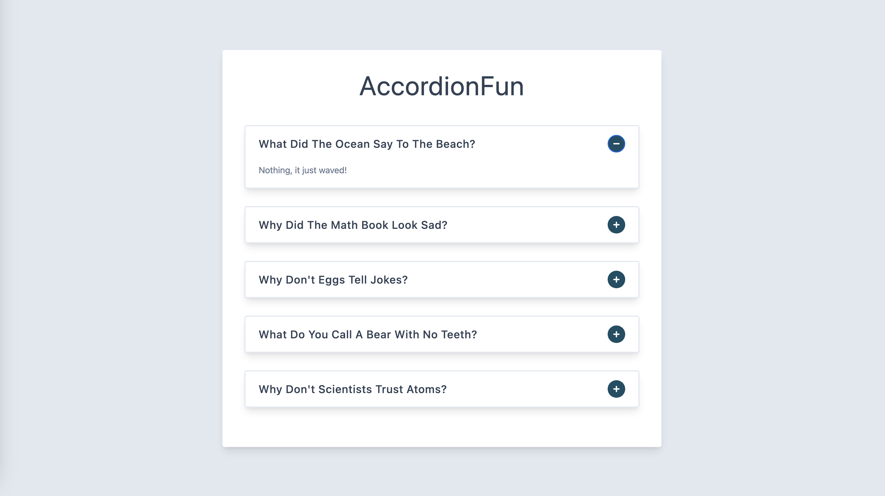

## AccordionFun

`AccordionFun` is a React-based project that brings an accordion experience to your web application. It allows to display a list of questions with their associated answers in an interactive `accordion format`. Users can easily `toggle` between questions to reveal the answers and read the content.

### The tech stack behind the project
- `JavaScript`
- `React` JavaScript library used for building the project.
- `useState` React hook used to manage state and create a state variable for the questions array.

### Discover the website
[AccordionFun Website](https://accordion-fun.netlify.app/)

### Preview
