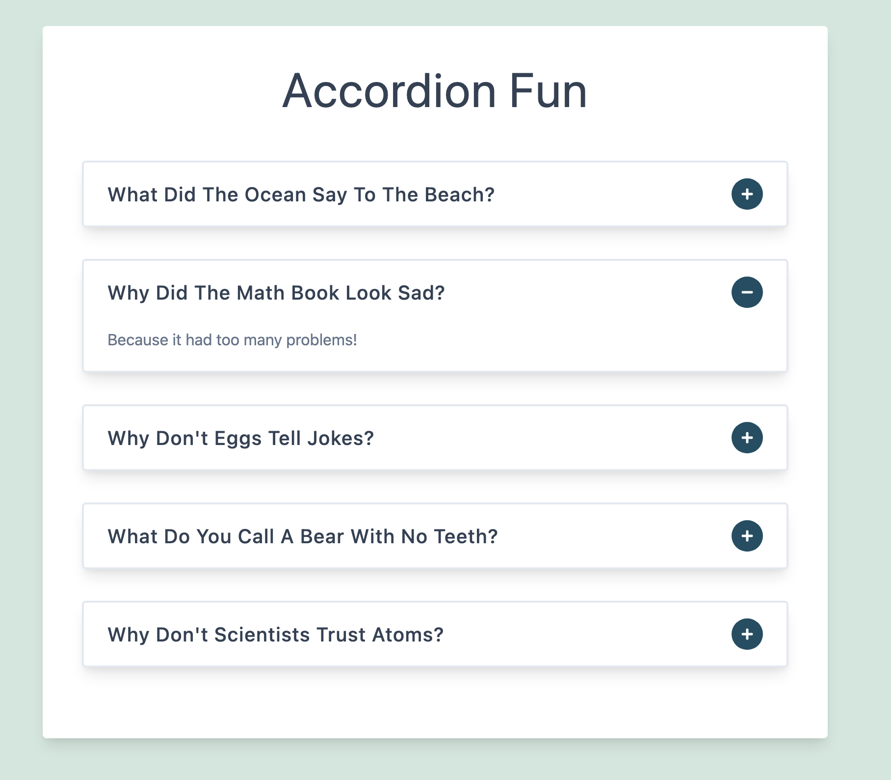

## AccordionFun

This app was crafted as a React hooks practice project, primarily centered around honing skills with `useState`. 
`AccordionFun` brings an accordion experience to your web application. It allows to display a list of questions with their associated answers in an interactive `accordion format`. Users can easily `toggle` between questions to reveal the answers and read the content.

### Tech Stack
- `JavaScript`: The foundational programming language for creating responsive and interactive features.
- `React`: The powerful JavaScript library used to build the project: 
- - `useState`: The React hook used to manage state.
- `React Icons`: The popular library that provides a vast collection of icons for enhancing the user interface and user experience in the project.

### Explore The Website
[AccordionFun on Netlify](https://accordion-fun.netlify.app/)

### Preview
